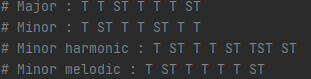
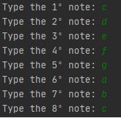
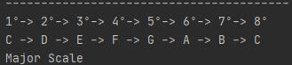

# Scales
<h3>English:</h3>

 A script that allow you to input the notes and it'll output the kind of scale.

A scale in music theory is a group of notes in sequence.

There are a lot of scales, and everyone can make your own scale, as far as it sounds god, or not, haha! But that's the cool thing about music, you have the rules.

In this script we have the most common cases of scale, which are:
-Major scale;
-Minor scale;
-Minor harmonic;
-Minor melodic.

<h3>Português:</h3>

Um script que permite o input das notas, e gera como output o tipo de escala.

Uma escala, em teoria músical, é uma sequência de notas.

Existem vários tipos de escalas, e qualquer um pode criar uma nova, isso é, se soar bem, ou não, hehe!Mas essa é a perte legal da música, você quem comanda.

Nesse script, nós temos os mais comuns tipos de escala, que são:
-Escala maior;
-Escala menor;
-Escala menor harmonica;
-Escala menor melódica.

<h3>Scale types:</h3>

<h3>Input:</h3>

<h3>Output:</h3>
